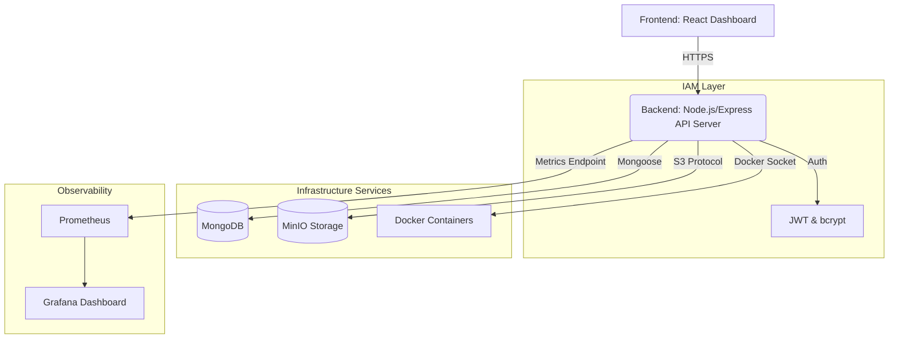

<h1 align="center">
  <br>
  🛡️ SecureMiniCloud
  <br>
</h1>

<h4 align="center">A Private Cloud Infrastructure & Security Platform</h4>

<p align="center">
  <a href="#features">Features</a> •
  <a href="#architecture">Architecture</a> •
  <a href="#tech-stack">Tech Stack</a> •
  <a href="#api-reference">API Reference</a> •
  <a href="#getting-started">Getting Started</a>
</p>


**SecureMiniCloud** is a comprehensive private cloud infrastructure platform engineered to replicate core capabilities of major cloud providers (like AWS). Built from the ground up, it offers a robust mix of Object Storage (S3-equivalent), Container Orchestration (EC2-equivalent), and Identity Access Management (IAM), all secured with encryption and monitored in real-time.

---

## 🚀 Features

### ☁️ Cloud Infrastructure
* **Object Storage (Mini-S3):** Upload, retrieve, and manage files securely. Powered by MinIO.
* **Container Orchestration (Mini-EC2):** Dynamically spawn and terminate isolated computing environments (Node.js, Python, Nginx) programmatically via Docker Engine API.

### 🔐 Security & IAM
* **Zero-Knowledge Architecture Prep:** AES-256 encryption applied to files *before* they are sent to the storage buckets.
* **Role-Based Access Control (RBAC):** Strict permissions matrices. `Admins` orchestrate servers; `Users` manage files.
* **JSON Web Tokens (JWT):** Secure, stateless authentication flow.

### 📊 Observability & Auditing
* **Intrusion & Audit Logging:** Comprehensive monitoring of user actions, failed logins, and resource mutations safely logged to MongoDB.
* **Telemetry Server:** Integration with Prometheus metrics and beautiful Grafana dashboards mimicking AWS CloudWatch.

---

## 🏗 Architecture



---

## 🛠 Tech Stack

| Domain | Technologies |
| --- | --- |
| **Frontend UI** | React, Vite, Lucide Icons, Vanilla CSS (Glassmorphism design) |
| **Backend API** | Node.js, Express, Mongoose, minio, dockerode, jsonwebtoken, crypto |
| **Databases** | MongoDB |
| **Storage** | MinIO |
| **Container Engine**| Docker Desktop / Docker Daemon |
| **Monitoring** | Prometheus, Grafana |

---

## 🔌 API Reference

### Identity & Access Management (`/api/auth`)
- `POST /register` - Register a new user (`User` or `Admin`).
- `POST /login` - Authenticate and retrieve JWT token.
- `GET /me` - Get current authenticated user details.

### Object Storage (`/api/storage`)
- `GET /` - List all encrypted objects in the cloud bucket.
- `POST /upload` - Upload file (Encrypted automatically via AES-256 in memory).
- `GET /download/:filename` - Stream and decrypt a specific object.

### Container Orchestration (`/api/containers`)
*Protected by Admin RBAC*
- `GET /` - List all dynamically spawned user instances.
- `POST /create` - Spin up a new micro-server (Node, Python, Nginx).
- `POST /:id/stop` - Gracefully stop an instance.
- `DELETE /:id` - Terminate and remove an instance.

---

## 🚦 Getting Started

### Prerequisites
- Node.js (v18+)
- Docker & Docker Compose (Critical for spinning up infrastructure and Mini EC2 instances)
- Git

### 1. Boot up the Infrastructure
Spin up MongoDB, MinIO, Prometheus, and Grafana.
```bash
git clone https://github.com/yourusername/SecureMiniCloud.git
cd SecureMiniCloud
docker compose up -d
```

### 2. Start the Backend API
The backend requires access to the Docker Socket to spawn mini containers. Running it natively on the host is the easiest way.
```bash
cd backend
npm install
npm run dev
# Server runs on http://localhost:5000
```

### 3. Start the Frontend Dashboard
```bash
cd frontend
npm install
npm run dev
# Dashboard available on http://localhost:5173
```

---

## 💡 Why This Project Stands Out

For engineering recruiters & teams, this project demonstrates high proficiency in:
1. **Cloud Architecture Fundamentals:** Demonstrating an understanding of how S3 and EC2 compute nodes actually operate under the hood.
2. **Applied Cryptography:** Real-world use of `crypto` / AES-256 for data preservation at rest.
3. **IAM Construction:** Developing a scalable JWT API with strict Role-Based access methodologies.
4. **DevOps & Observability:** Implementing a robust observability pipeline using Prometheus/Grafana. 

<br>
<p align="center">
  <i>Engineered with security and scale in mind.</i>
</p>
